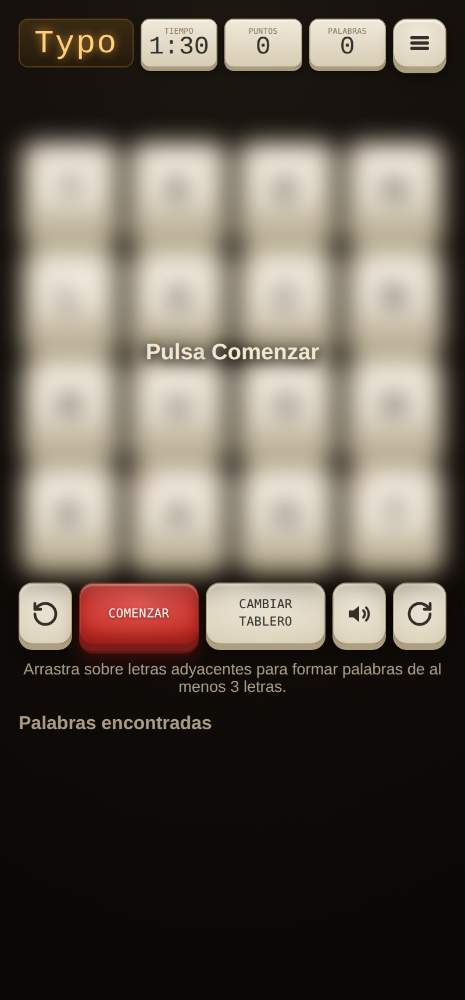
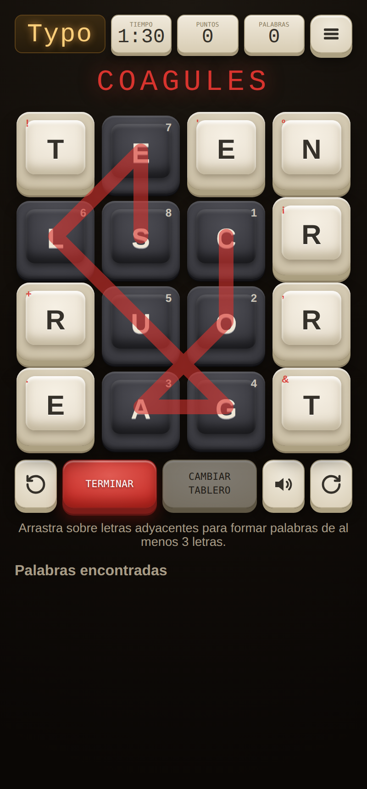
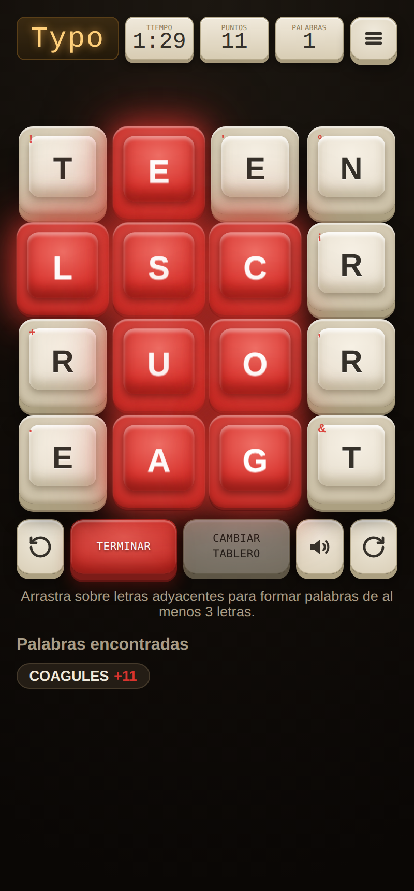
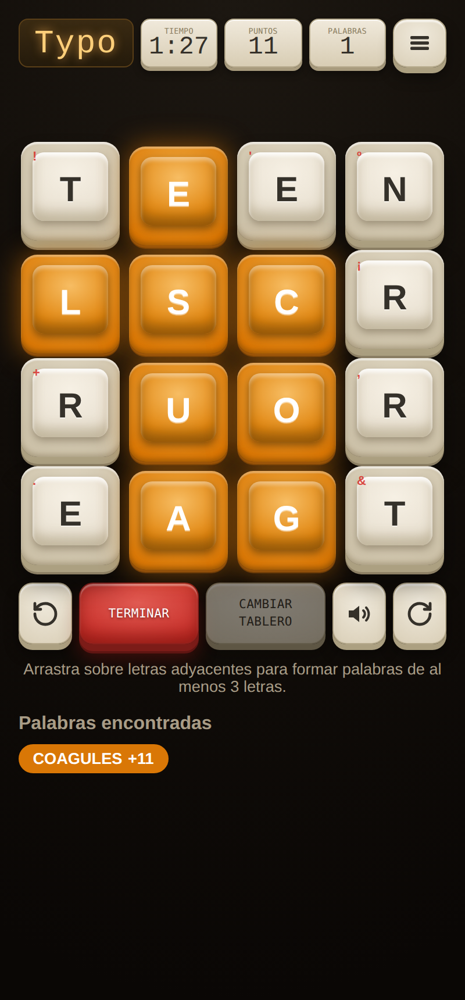
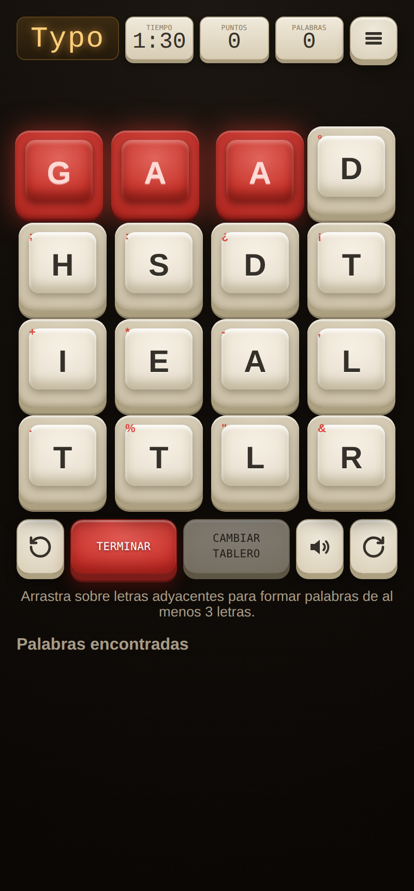
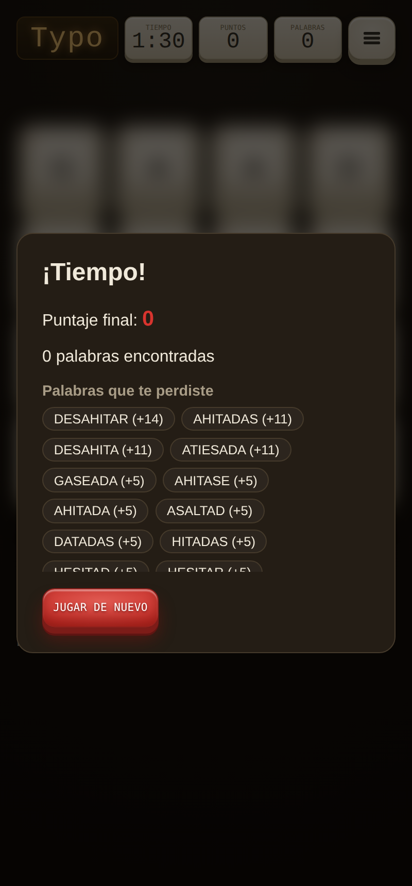
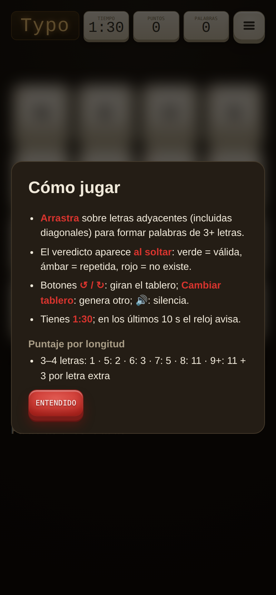
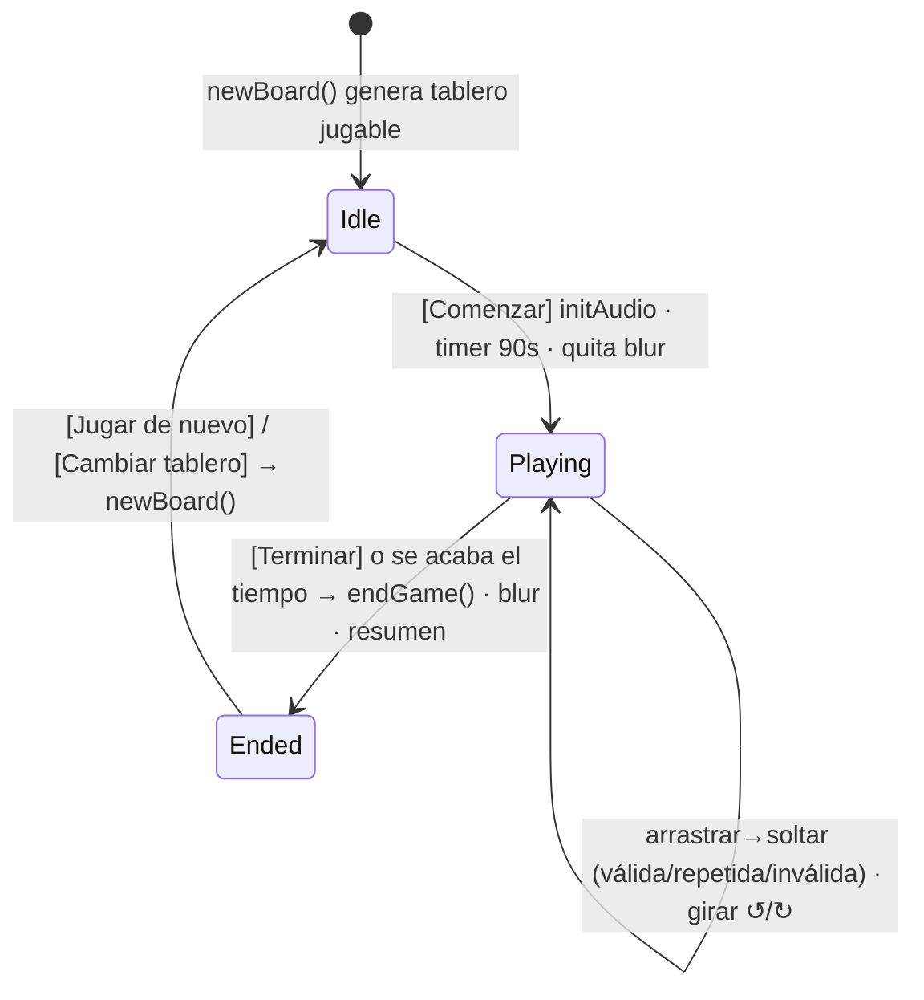

# Typo — Documento maestro de diseño y estado

> Snapshot completo de lo construido, para pasar a un diseñador / a Claude design y
> proponer cambios. Repo: `minarkhamprojects/Typo_game` (rama `main`).
> Última versión descrita: commit `ecb5732`.

---

## 1. Qué es

**Typo** es un buscapalabras estilo **Boggle**: un tablero **4×4** de letras en español,
contrarreloj (**1:30**). El jugador **arrastra** sobre letras adyacentes (incluidas
diagonales, sin repetir celda) para formar palabras de **3+ letras**. Se juega en el
navegador, sin backend ni instalación.

- **Stack**: HTML + CSS + JavaScript vanilla (sin frameworks, sin build).
- **Diccionario**: ~636.000 palabras en español (incluye conjugaciones), embebido.
- **Archivos**: `index.html` (markup), `style.css` (todo el diseño), `game.js` (lógica
  de UI), `engine.js` (motor puro: grid, diccionario, resolver, puntaje), `words_es.js`
  (diccionario embebido), `data/words_es.txt` (fuente), `scripts/build_words.py`.
- **Deploy**: se juega abriendo `index.html`; para móvil se usa una URL de githack por
  commit (p. ej. `rawcdn.githack.com/minarkhamprojects/Typo_game/<sha>/index.html`).

---

## 2. Identidad visual actual — "keycap retro 8BitDo + terminal 90s"

Escena oscura cálida, teclas crema tipo keycap con relieve 3D real, acento rojo, y
tipografía/iconos inspirados en teclados y terminales de los 90s.

### 2.1 Paleta (tokens CSS, en `:root` de `style.css`)

| Token | Valor | Uso |
|---|---|---|
| `--accent` | `#d8342e` | Acento: palabra correcta, estela, botón, lectura. **Una sola variable re-tinta todo.** |
| `--accent-hi/-lo/-skirt` | derivados con `color-mix` | claro/oscuro/faldón del acento |
| Fondo escena | `radial-gradient(140% 100% at 50% 0%, #1c1711, #110d09 55%, #0a0705)` | fondo cálido oscuro del `body` |
| `--text` / `--text-muted` | `#f0e9da` / `#a89c86` | texto claro / atenuado |
| `--surface` / `--surface-border` | `#241d15` / `#453a2b` | modales, chips |
| Tecla crema cara | `linear-gradient(158deg,#efe9db,#ddd3bd)` (cuerpo real: `radial-gradient(125% 120% at 50% 32%,#e2d9c5,#ccc1a8 58%,#a89b7d)`) | reposo |
| Tecla crema leyenda | `#35312a` | tinta grabada |
| Tecla crema faldón | `#aca081` / `#8d8065` (doble) | grosor 3D |
| Tapa cóncava crema | `radial-gradient(120% 105% at 50% 30%,#f6f0e4,#eae2d3 56%,#d7cdb8)` | dish `::before` |
| Tecla arrastre (oscura) | cuerpo `#55555c→#3a3a40→#26262b`, faldón `#17171b/#0e0e11` | letra seleccionada |
| Correcta (rojo) | cuerpo `#e05a52→#c62d27→#8f201c`, dish `#ef6f66→#d8342e→#b0241f`, faldón `#7c1c18/#5f1512` | acierto |
| Inválida | cuerpo `#d84a41→#b32a23→#7f1c17` | palabra que no existe |
| Repetida (ámbar) | `--dup #d97706`, faldón `#92500a` | palabra ya encontrada |
| Marca roja tecla | `rgba(216,52,46,.9)` (fijo) | símbolo mini arriba-izq |
| LCD ámbar | fondo `linear-gradient(180deg,#3a2a12,#241a0b)`, texto `#ffcf7a` glow | pantalla "Typo" y marcadores |

### 2.2 Tipografías

- `--font-display`: **Archivo** (800–900) → letras del tablero (keycap legends).
- `--font-ui`: **Space Grotesk** → texto de apoyo, hints, modales.
- `--font-lcd`: **VT323** (terminal/dot-matrix) → pantalla LCD "Typo", lectura de la
  palabra en curso, y valores de los marcadores (TIEMPO/PUNTOS/PALABRAS).
- `--font-pixel`: **Silkscreen** → etiquetas mini (TIEMPO…) y texto de botones (uppercase).
- Se cargan por Google Fonts. En el Artifact de claude.ai el CSP bloquea las fuentes y
  caen a los fallbacks (monospace/sans); en githack se ven completas.

### 2.3 Keycap 3D (receta exacta, letras del tablero)

Cada tecla = un `div.cell` con `span.key-legend` + `span.key-mark`, más un `::before` que
hace la tapa cóncava.

```css
.cell {
  aspect-ratio: 1/1; border-radius: 14px;
  background: radial-gradient(125% 120% at 50% 32%,#e2d9c5,#ccc1a8 58%,#a89b7d);
  box-shadow:
    inset 0 2px 1px rgba(255,255,255,.6),
    inset 0 -2px 5px rgba(120,105,72,.4),
    0 6px 0 #aca081, 0 8px 0 #8d8065,      /* faldón doble = grosor */
    0 15px 20px rgba(0,0,0,.45);           /* sombra de contacto */
}
.cell::before {                            /* tapa cóncava */
  left:12%; right:12%; top:11%; bottom:19%; border-radius:10px;  /* más recortada abajo */
  background: radial-gradient(120% 105% at 50% 30%,#f6f0e4,#eae2d3 56%,#d7cdb8);
  box-shadow: inset 0 3px 3px rgba(255,255,255,.85),
              inset 0 -8px 10px rgba(150,135,100,.42), 0 3px 7px rgba(80,66,42,.42);
}
```

Al presionar/estado activo: `transform: translateY(4px)` y faldón colapsado.

### 2.4 Iconos (estilo teclado 90s)

SVG inline monocromos que **heredan la tinta** de la tecla (`currentColor`, `#35312a`):
- **Sonido**: bocina (cono relleno) + 2 ondas (trazo). Silenciado (`#mute-btn.muted`):
  se ocultan las ondas y aparece un **tachado rojo** (`--accent`).
- **Girar ↺ / ↻**: flechas circulares (trazo grueso 2.4).
- **Menú ☰**: 3 barras rellenas.

---

## 3. Layout / distribución

Ancho de las tres franjas: `min(92vw, 440px)`, centradas.

1. **Barra superior** (`.topbar`, fila flex, gap 6px):
   `[ LCD "Typo" (flex 1.4, pantalla ámbar) ] [ TIEMPO ] [ PUNTOS ] [ PALABRAS ] [ ☰ ]`
   - Cada marcador es una **tecla crema** (`.stat-key`): etiqueta pixel arriba (Silkscreen),
     valor LCD abajo (VT323). IDs: `#timer`, `#score`, `#word-count`.
   - `☰` (`#menu-btn`) abre el modal "Cómo jugar".
2. **Tablero** (`.grid`, 4×4, `gap ~7px`): teclas **flotando sobre la escena oscura**
   (sin placa/chasis). Encima, un `<svg>` overlay dibuja la **estela** (polyline) que
   conecta las letras; y un rótulo **"Pulsa Comenzar"** cuando está difuminado.
3. **Barra inferior** (`.controls`, fila flex): `↺ · Comenzar · Cambiar tablero · 🔊 · ↻`
   - Cuadradas (`.key-btn.sq`, ancho fijo 46px): giros y sonido.
   - Anchas (`.btn.wide`, flex 1): **Comenzar** (rojo, keycap) y **Cambiar tablero** (crema).
4. **Lectura de palabra** (`.current-word`): encima del tablero, en VT323 acento con glow.
5. **Hint** + **Palabras encontradas** (chips) debajo.

**Blur pre-partida**: antes de Comenzar y al terminar, el tablero se difumina
(`filter: blur(10px)`) con el rótulo "Pulsa Comenzar", para no estudiar las letras con el
reloj parado.

---

## 4. Interacción y estados

### 4.1 Selección (arrastre)
- Pointer Events (mouse + touch). Se conectan letras **adyacentes** (incl. diagonales),
  sin repetir celda, mínimo 3.
- **Zona muerta**: una celda solo se agrega cuando el dedo está cerca de su centro (60%
  del semilado) → no selecciona vecinas por rozar bordes.
- **Puente**: si un arrastre rápido salta una celda intermedia, se rellena sola (arregla
  la detección de palabras largas).
- Retroceder sobre la penúltima celda deshace el último paso.
- La tecla en arrastre se ve **oscura** (tipo Ctrl/Shift) y hundida; se dibuja el número
  de orden.

### 4.2 Veredicto (al soltar)
- **Verde/rojo/ámbar solo al soltar** (no hay "válida en vivo" durante el arrastre).
- Válida y nueva → **rojo acento** con glow + `typoPulse`, suma puntos, chip en la lista.
- Repetida → **ámbar** + se resalta el chip existente; no suma.
- Inexistente → **rojo error** + `typoShake`.

### 4.3 Temporizador
- 1:30 (90 s). En los **últimos 10 s** el reloj se pone en acento y **pulsa**, con **tick
  sonoro** y vibración por segundo.

### 4.4 Botón principal (rojo)
- Alterna: **Comenzar** → **Terminar** (corta la partida y muestra el resumen) →
  **Jugar de nuevo**.

### 4.5 Resumen final (modal)
- Puntaje final, nº de palabras, **la(s) palabra(s) más larga(s)** con su nº de letras
  (muestra empates), y hasta 15 **palabras que te perdiste** (las de mayor puntaje).

### 4.6 Giro del tablero
- `↺` / `↻` giran la matriz 90° (antihorario/horario) en cualquier momento; las
  adyacencias (y por tanto las palabras posibles) no cambian: solo la perspectiva.

### 4.7 Menú ☰
- Abre "Cómo jugar": controles + tabla de puntaje.

---

## 5. Sonido (Web Audio, sintetizado, sin archivos)

`AudioContext` creado en el click de **Comenzar** (requisito de iOS). Todo son osciladores
cortos con envolvente exponencial (`tone(freq, startIn, duration, type, volume)`):

| Evento | Sonido |
|---|---|
| Conectar letra | click `square` 1400–1900 Hz, 35 ms, vol .06 (tono variable) |
| Palabra válida | chime `triangle` 523→659→784 Hz (do-mi-sol), vol .22 |
| Palabra repetida | doble `triangle` 440 Hz |
| Palabra inválida | buzz `sawtooth` 160→120 Hz |
| Tick de aviso (≤10 s) | `square` 880 Hz, 60 ms |

- **Botón 🔊 / silencio** persiste en `localStorage` (`typo-muted`).
- **iOS**: `navigator.audioSession.type = "playback"` (suena aunque el iPhone esté en
  silencio, iOS 16.4+), unlock con buffer silencioso, y `resume()` automático si el
  contexto se suspende (bloqueo de pantalla / cambio de app / volver la pestaña).
- **Haptic**: `navigator.vibrate` en Android; en iOS no existe la API (best-effort con un
  switch nativo oculto). Haptic pleno solo sería posible con app nativa.

---

## 6. Puntaje (en `engine.js`)

| Largo | Puntos |
|---|---|
| 3–4 | 1 |
| 5 | 2 |
| 6 | 3 |
| 7 | 5 |
| 8 | 11 |
| 9+ | 11 + 3 por cada letra extra sobre 8 |

Generación de tablero: letras al azar con **frecuencia real del español** (incluye Ñ);
se valida que el tablero tenga ≥60 palabras posibles. Diccionario validado por búsqueda
binaria sobre el texto ordenado + un mini-trie por tablero (memoria baja: ~15–35 MB).

---

## 7. Detalle decorativo

- **Marcas rojas** en las teclas (arriba-izq): símbolos rotando por posición del array
  `["!","·","'","º",";",":","¿","¡","+","*","-",",",".","%",'"',"&"]`, en rojo fijo
  `#D8342E`. Se ocultan cuando la tecla está seleccionada o en un veredicto.

---

## 8. Ideas / pendientes abiertos (backlog)

- Récord personal con `localStorage`.
- Modo sin temporizador (libre).
- **Tips en pantalla** (idea a definir): consejos rotando en la LCD.
- **Selector de acento** (idea opcional): elegir el color de acierto desde el menú.
- Haptic pleno en iOS (requiere app nativa).

---

## 9. Cómo probar

- Local: abrir `index.html` en el navegador.
- Móvil (última versión): `rawcdn.githack.com/minarkhamprojects/Typo_game/<sha>/index.html`.
- URL fija (pendiente de activar): GitHub Pages → `minarkhamprojects.github.io/Typo_game`.

---

## 10. Capturas por estado

> Capturas a 400×860 @2x. **Nota**: se tomaron en un entorno que bloquea Google Fonts,
> así que la LCD y las etiquetas salen con las fuentes de respaldo (no con VT323/
> Silkscreen); en githack se ven las pixel/terminal reales. Todo lo demás (keycaps 3D,
> iconos, colores, estados) es fiel.

| Estado | Captura |
|---|---|
| **Reposo (blur pre-partida)** — tablero difuminado + "Pulsa Comenzar" |  |
| **Arrastre** — teclas oscuras tipo modificador + estela roja + nº de orden |  |
| **Palabra válida** — retroiluminación en acento (rojo) con glow + pulse |  |
| **Palabra repetida** — ámbar en las teclas + chip resaltado |  |
| **Palabra inválida** — rojo error + shake |  |
| **Resumen final** — puntaje, más largas, palabras que te perdiste |  |
| **Menú ☰ / Cómo jugar** |  |

En reposo/juego se ven los detalles: pantalla **LCD "Typo"**, marcadores como teclas
crema, **iconos 90s** (menú de barras, bocina con ondas, flechas de giro), y la **marca
roja** mini en cada tecla.

---

## 11. Flujo de la partida



- **Botón principal (rojo)** por estado: `Idle`→**Comenzar**, `Playing`→**Terminar**,
  `Ended`→**Jugar de nuevo**.
- **Aviso**: en `Playing`, cuando `timeLeft ≤ 10 s`, el reloj entra en modo alerta
  (acento + pulse + tick sonoro + vibración por segundo).
- **Veredicto** (solo al soltar): la ruta se pinta verde/ámbar/rojo 480 ms y se limpia;
  suma puntos solo si es válida y nueva.

